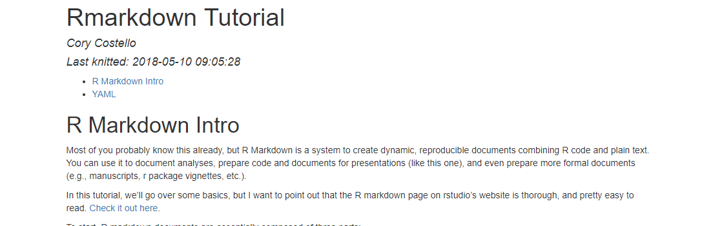
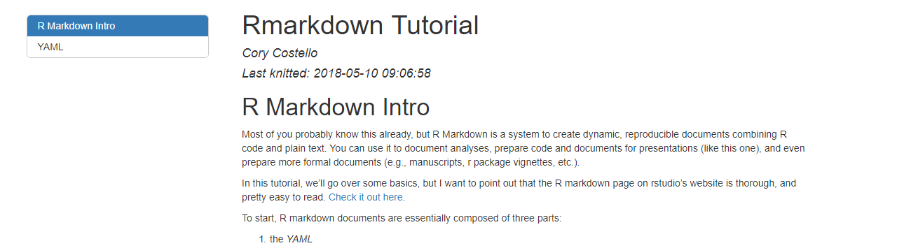

```{r setup, warning=F, message=F, echo=F}
library(tidyverse)
```

# R Markdown Intro

Most of you probably know this already, but R Markdown is a system to create dynamic, reproducible documents combining R code and plain text. You can use it to document analyses, prepare code and documents for presentations (like this one), and even prepare more formal documents (e.g., manuscripts, r package vignettes, etc.).

In this tutorial, we'll go over some basics, but I want to point out that the R markdown page on rstudio's website is thorough, and pretty easy to read. [Check it out here](https://rmarkdown.rstudio.com/).

To start, R markdown documents are essentially composed of three parts:

1. the *YAML*
    * *Yet Another Markup Language*
    * This is the part of the document at the top, demarcated by three dashed lines on either side. In this document, it is at lines 1-12.
    
2. Plain text /  Markdown.
    * This is basically everything you type outside of the code chunks (and outside of the yaml too).
    * This can be plain text per se (i.e., just typing out some alphanumerics) or stylized text using markdown.
        * For example, *italics*, **bold**, links, etc. 

3. Code chunks
    * These are the chunks of the document where you put R code (or code from other supported languages).
    * A code chunk starts with three backticks and a set of curly brackets, and ends with three backticks.
        * if the code chunk is R code, which it usually will be, an r is needed inside the curly brackets
        * More can go into the curly brackets, which is mentioned later.

Let's start by going over the basics of the YAML.

# YAML

Again, this stands for yet another markup language. To keep things simple, a markup language is a programming language for processing and presenting text. Markdown is a markup language too; hence, *yet another markup language*.

If you're newer to r markdown, you will probably only need to worry about 4-5 parts of your yaml. And, as you've probably realized, there is a little dialog box to set the essential parts (title, author, date, and output format) when you click `file > new file > R Markdown...`

## Title

This one is pretty straightforward. It is where you put the title to your document. The title is wrapped in quotes, like so:  

`title: "This is a title"`

You can use many of the same markdown annotations:

`title: "This is a title: *this part is in italics*"`

`title: "This is a title: **this part is in Bold**"`

You can also include inline code in your title, if you ever find a need for that.


## Author
 
This one is also really straightforward. This is where you can put your name. You can use markdown annotations here too, if you ever find a need. It also needs to be wrapped in quotes:

`author: Cory Costello`

## Date

This one is also really straightforward.This is where you enter the date. It also needs to be wrapped in quotes. Like the others, you can use markdown annotations here. I actually really like to use inline r code in my date field, so these days I almost exclusively do some code like this:

`last knitted: `r Sys.time()`

This is what I did in the present document, and this makes it so the date field is populated by "last knitted:" followed by the current date/time (according to my computer).

## Output

This is where things can get a little more complicated, if you so choose. Let's start simple. This can be as little as specifying the output format:

`output: html_document`

Some commonly used formats for documents are:

* html_document
* pdf_document
    * Note, if you're planning on using pdfs (which I recommend), you'll need to get a tex compiler.
        * If windows: [MikTex](https://miktex.org/)
        * If Mac: [MacTex](http://www.tug.org/mactex/)
        * If Linux/Unix: [TexLive](https://www.tug.org/texlive/)
* word_document

Some less commonly used formats for documents are are:

* odt_document
    * This is apparently an open source text document.
* html_notebook
    * Interactive R notebook
    * conceptually similar to jupyter notebooks, if you're familiar with those.
* rtf_document
   * rich text format document
* md_document
    * markdown document
    * useful for certain systems that accept markdown input:
        * Stack Overflow
        * Github
        * WordPress
    * You can also specify a markdown variant for a given system:
        * markdown_strict
            * original markdown
        * markdown_github
            * This one is pretty useful.
        * markdown_mmd
           * multimarkdown
        * markdown_phpextra
        * [More information here](https://rmarkdown.rstudio.com/markdown_document_format.html)
    * Specifying a variant looks like this:
```
output:
  md_document:
    variant: markdown_github
```

You can also add some other stuff in here if you want to get fancy. Most of this will affect the style of the text, or code highlighting. For example, you can use a css (cascading style sheet) to provide a style for the document. That is probably beyond what most of us want to do, but it is possible.

There are also alternative to documents, such as slide shows. I'm not going to go over those here, but it's worth looking into. [More info here.](https://rmarkdown.rstudio.com/ioslides_presentation_format.html)


### Table of Contents

Any of the document outputs (at least the commonly used ones) can have a table of contents. This often goes under the `output:` section, which is why I've included it in the output section here. But it can be its own section. If it is its own section, it looks like this:

```
toc: TRUE
```
It's flush against the lefthand side, just like the other sections.


It can also be within the output section, which is what it looks like in this document.

```
output: 
  html_document:
    toc: true
```
The advantage to this is that it allows you to use some output-specific options in the table of contents. For example, in `html_documents`, you can specify some cool options, like a floating table of contents, which can be done with this code:

```
output: 
  html_document:
    toc: true
    toc_float: 
```
This makes it so the table of contents is a floating side bar, so that you don't have to scroll to the top to access it. For example:

Not Floating:



Floating: 


There are some other options, such as Collapsed, which makes it so that lower headings aren't visible until you click on the corresponding upper header. For example, the subheaders under YAML (e.g., title) are hidden in the above image, but they would become visible once we clicked on YAML. This is because I set `collapsed: TRUE`

The last TOC option I'll mention is `smooth_scroll:`, which works for floating table of contents. This one is makes it so that the floating table of contents changes what heading is selected when you scroll. For example, if you scroll through this html document from the beggining to the Date section, the date section of the table of contents will be highlighted. 

### Data Frame Printing

In the output section we can set how we want dataframes to print. Options are a little more limited in pdfs, but html documents have this very cool option:

```
html_document:
    df_print: paged
```
This makes it so that any dataframe you print is printed as a sort of interactive table, where you can scroll through the rows and columns of the dataframe.

For example, let's see what the `flights` dataframe from the `nycflights13` library looks like:

```{r}
library(nycflights13)

flights
```

For whole dataframes, this may be more or less useful. But, anything that is represented as a dataframe will be printed this way. For example, we could make a large summary table

```{r}
flights %>% 
  group_by(carrier) %>% 
  summarize(mean_arrival_delay = mean(arr_delay, na.rm = TRUE),
            sd_arrival_delay = sd(arr_delay, na.rm = TRUE))

b0 <- 3.5
```

There are a lot of other options that can be included in the YAML, but I'll leave it at this for now.

# Plain Text, Markdown, and Inline Code

## Plain Text & Markdown

90% of what you will ever need to do as far as plain text and markdown annotations can be found in the R Markdown Quick Reference. You can access this by: `help > Markdown Quick Reference`

This document already has a lot of the markdown annotations you'll need, but here is a table with some common ones. First, to make a table, you just use dashes ('-') and pipes/vertical lines ('|'), and use those to build a table (pretty intuitive). Now, let's use that to make a table of common R markdown Annotations.

Annotation                  | Code
----------------------------|-------------------------------------------------------------------
Headers                     | # (the number of '#' is the). for example, ## is 2nd level header
Italics                     | wrap in single astericks (`*italics*`)
Bold                        | wrap in double astericks (`**bold**`)
strike through              | wrap in 2 tildas (`~~get this outta here~~`)
Superscript                 | wrap in carrot (`x^2^`)
Subscript                   | wrap in single tilda (`b~0~`)
inline (not evaluated) code | wrap in single backticks (`code`)
inline (evaluated) R code   | same as above, but starts with r (`r 5+5`)
URL link                    | `[link text](URL)`
Image Link                  | `` path can URL or directory
In line equation            | wrapped in single dolar signs (`$E = mc^2$`)
Diaply Equation (own line)  | wraped in double dolar signs `$$ E = mc^2$$`
Quote                       | >

Let's go through some examples.

### Basic Annotations Example

*Italian* coffee is known for being **bold** in flavor. So get that damn ~~weak american coffee outta here~~. Some say that italian coffee is like american coffee^2^. In other words, $italian coffee = american coffe^2$, or more formally:
$$Italian Coffee = American Coffee^2$$

Or, if we wanted to write out our formula for good coffee, maybe it would be

$$coffee quality = b_0 + \\
                   b_1*flavor + \\
                   b_2*country_of_origin + \\
                   b_3*amount_of_whiskey_in_the_cup$$

And then we could refer to the intercept b~0~ or $b_0$. If we had the data, we could test this using the `lm()` function, or if we wanted to print the value we could use inline R code `r round(b0, 2)`. We might include a link to the [wikipedia entry on coffee](https://en.wikipedia.org/wiki/Coffee). Perhaps we want to provide a quote about coffee's entry into Europe:

>From the Middle East, coffee spread to Italy. The thriving trade between Venice and North Africa, Egypt, and the Middle East brought many goods, including coffee, to the Venetian port. From Venice, it was introduced to the rest of Europe. Coffee became more widely accepted after it was deemed a Christian beverage by Pope Clement VIII in 1600, despite appeals to ban the "Muslim drink." The first European coffee house opened in Rome in 1645.

## More on Inline Code

We've already seen a bit of inline code, but it's worth its own subsection. This can be a really useful tool if you're using Rmd's to write a manuscript, but can also be useful for your own documentation.

You can inline code to do math in the middle of your plain text if you need to. For example, we might want to say that we have 3 groups and need 40 people per group, and so we need a total N of $N_total$ = `r 3*40`. But, where this gets really powerful is pulling from objects that we've created in R. For example, we might want to pull the average delay from the flights data, which we could do by doing this: `r mean(flights$arr_delay, na.rm = TRUE)`. Or, we can combine multiple functions in inline code, for example, if we wanted to round that average we could combine `mean()` and `round()`, like so: `r round(mean(flights$arr_delay, na.rm = TRUE), 2)`. And, we could combine this with the formula notation and say the average flight delay is, $M_{delay} = $ `r round(mean(flights$arr_delay, na.rm = TRUE), 2)`, with a standard deviation of $SD_{delay} = $ `r round(sd(flights$arr_delay, na.rm = TRUE), 2)`. Later on, we'll return to using inline code to pull results and print them in text.

## More on Equations

As we've seen, we can put formulas in line with dollar signs $X = 5$, or display it with 2 dollar signs. 
$$X = 5$$

But, we can also use Equations to display symbols or greek letters, which is something we need to do sometimes. For instance, I might want to say the result of a Chi-Square test, and I can do that with the actual symbol/greek letter by using equation notation. There are lots of symbols and greek letters available, all of which are displayed by referencing their latex codes. There is a helfpul [list of latex equation codes here](https://www.sharelatex.com/learn/List_of_Greek_letters_and_math_symbols). For example, $\chi^2$ is `\chi^2`. 

In addition to symbols and letters, we can also do more complicated things. A pretty thorough guide to what's possible with latex equiations can be [found here](https://en.wikibooks.org/wiki/LaTeX/Mathematics). For example, we might want to display a fraction, for example if we were reporting chi-sq/df ratios. That is done using `\frac`, with the following syntax: `\frac{numerator}{denominator}`. So that code looks like `\frac{\chi^2}{df}`, like so:

$\frac{\chi^2}{df}$

The last thing that I'll mention is that if you have a sub- or superscript that is more than one character, you need to wrap it in curly brackets. For example, if we wanted to raise x to the power of 21, our code should look like `x^{21` or $x^{21}$, this is what happens if we don't use curly brackets $x^21$. As you can see, it turns into x-squared with a 1 next to it.

# Code Chunks

Finally, one of the most important parts of an rmarkdown is a code chunk; we're in R to run R code afterall. As mentioned above, a code chunk is demarcated by three backticks, curly brackets, and the language of the code within the curly brackets. In the vast majority of cases, your chunks will be R code chunks, so they'll start with r, like so:

```{r}

```

Note, the keyboard shortcut to insert an R code chunk is:
* windows: ctrl alt i
* mac: command opt i

Once you have a code chunk, you can put R code in it. By default, any code in the chunk will be displayed in the rendered document, as will any output. So, if we wanted to predict delay time of flights by airport origin, we could run an `lm()`

```{r}
model1 <- lm(arr_delay ~ origin, data = flights)
summary(model1)
```

As you can see, both the code and output is displayed, which is the default. However, this can changed using *code chunk options*.

## Code Chunk Options

Code chunk options are various ways that you can change how code chunks operate. You can change what gets displayed, how it gets displayed, and some other useful stuff. 

There are **a ton** of options. All of them are listed [here](https://yihui.name/knitr/options/). i'll just mention a few that I find particularly useful below.

option     | what it does                                                               | arguments
-----------|----------------------------------------------------------------------------|--------------------
eval       | evaluation - tells R whether or not to evaluate (run) the code in a chunk. | TRUE or FALSE
echo       | tells R whether or not to print the code in the chunk                      | TRUE or FALSE
warning    | tells R whether or not to display warning messages                         | TRUE or FALSE
error      | tells R whether or not to display error messages                           | TRUE or FALSE
message    | tells R whether or not to display messages                                 | TRUE or FALSE
include    | whether to include chunk output in rendered document                       | TRUE or FALSE
cache      | whether R should store results after the session                           | TRUE or FALSE
fig.width  | width of figure code chunk is printing                                     | number in inches
fig.height | height of figure code chunk is printing                                    | number in inches
fig.dim    | can provide width and height together with this                            | 2 numbers in inches
fig.align  | where to align a figure                                                    | left, right, center
fig.cap    | figure caption                                                             | text
fig.path   | where to save the figure                                                   | text
dpi        | pixel resolution                                                           | number in pixels
colormodel | color space for figures                                                    | text (e.g. 'cmyk')

Again, there are many others, but these are the ones I use most.

### Specifying Code Chunk Options per Chunk

You can specify options per code chunk by putting them in the header of the chunk (the part in the curly brackets). And, each option is separated by a comma. 

You can also set them globally, with `knitr::opts_chunk$set()`. You just place options in the parantheses.
